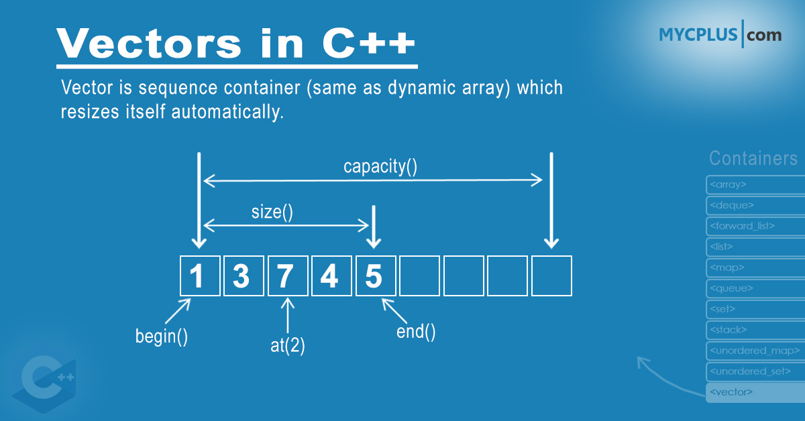

# ft_containers

L'obiettivo del progetto é quello di implementare i contenitori e alcune funzioni utili della libreria STL.

Questa libreria introduce i template, oggetti che permettono la scrittura di funzioni e classi senza specificare il tipo di dato con cui andranno ad interagire.

I contenitori non sono altro che l'implementazione di strutture dati implementate appositamente per soddifare particolari esigenze. Per fare chiarezza: int è un dato, mentre un array di interi è una struttura dati.

In questo progetto ne vedrai quattro:

Vector(vettore): una struttura dati basata su array, ma dinamico, ovvero che viene allocata nuova memoria una volta che non è possibile inserire nuovi valori.
Stack(pila): vecchia conoscenza del progetto push_swap, si tratta di una struttura dati basata su vettore, che inibisce alcune funzioni del vettore e la specializza per funzionare come una stack.

Map e Set: due strutture dati che si poggiano su gli alberi, una struttura dati basata su nodi con tre puntatori, uno detto destro che punta ad un nodo contenente un valore inferiore al nodo attuale, e uno detto sinistro, che punta ad un nodo contenete un valore superiore al nodo attuale, infine uno detto padre che punta al nodo precedente. Tale implementazione permette la ricerca di un valore molto rapida (se bilanciato). Ogni nodo ha due valori, uno detto chiave, che viene utilizzato per la ricerca all'interno della struttura, e l'altro detto di mappatura, che é il vero valore. In altre parole il valore di chiave sta al vettore come l'indice e il valore di mappatura come al valore di quel indice. Dunque il set differisce dalla mappa in quanto nel set tali valori corrispondono. Nell'atto pratico il set è un vettore piú performante, mentre la map è un vettore dove possiamo decidere noi il tipo che avrà l'indice.
Discorso a parte va fatto sugli iteratori, che non sono altro che un puntatore ad un valore della struttura dati, che se incrementato punterà al valore successivo, se decrementato punterà al valore precedente, o deferenziato, accedendo al valore a cui punta. Come ben puoi immaginare, l'implementazione di quest'ultimo è diversa per ogni contenitore.

Link utili
implementazione dell'albero rosso-nero
implementazione della map e del set con albero rosso-nero
tester utilizzato per validare il progetto
Informazioni utili
leggi attentamente il subject
Tutte le informazioni che ti saranno necessarie per l'implementazione di ogni contenitore le trovi su i siti di reference, personalmente consiglio cppreference
prima cosa sicuramente da comprendere appieno è la classe std::allocator.
Personalmente ho torovato questo progetto molto complesso, quindi è normale se ci metterai più tempo del dovuto e sicuramente trovarti dei compagni ti potrebbe aiutare molto.
