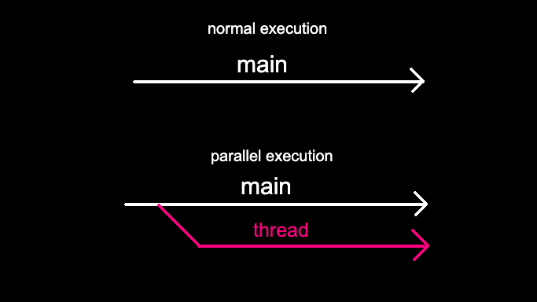

# Dining Philosophers

<p align="center">
  
</p>

If you like me never heard about the Dining Philosophers, I suggest to read the [relative Wikipedia page](https://en.wikipedia.org/wiki/Dining_philosophers_problem).

## Mandatory Part
<p align="justify">
The difference between the problem and the subject is the implementation of the time limit: philosophers can't stay too much without eating, the eating need a while to be done, like also sleeping. All these variables are set runtime, and has to be parsed and checked.
Every philo (in the mandatory part) has to be a thread. The thread is a part of code execute in parallel, so that mean that we can execute code in the same time. This thing is very interesting as it allows us to take full advantage of the multithreaded technology of current processors.
</p>

[Short introduction to thread](https://code-vault.net/course/6q6s9eerd0:1609007479575/lesson/18ec1942c2da46840693efe9b51d86a8)

<p align="center">
  
</p>
<p align="justify">
But it doesn't mean that is simple: sharing variables between threads can be dangerous, since parallel execution is not actual, but the threads are executing one per time. This implies that the share variables could be modify impropely, causing errors, so is important to prioritize them. This means that when a variable is used by a thread, has to be lock, so no others can use them. Mutexes are used for this purpose.
</p>

[Problems with Sharing Variables to Multiple Threads](https://code-vault.net/course/6q6s9eerd0:1609007479575/lesson/18ec1942c2da46840693efe9b51ea1a2)   
[Using Mutexes](https://code-vault.net/course/6q6s9eerd0:1609007479575/lesson/18ec1942c2da46840693efe9b51eabf6)

## Bonus Part

<p align="justify">
In the bonus part, the philosophers are supposed to be created like processes: this mean that they are not part of the same program, so mutexes are unuseful. Fo this comes the semaphores, a mutex like variable that gives us the possibilities to prioritize the use of variables. 
</p>

[Introduction to Semaphores](https://code-vault.net/course/6q6s9eerd0:1609007479575/lesson/v9l3sqtpft:1609091934815)

## Some advices
- you have to know that `exit()` is forbidden in the Mandatory Part;
- the `usleep()` is deprecate by The Manual, so you have to implement a "checker" to make it works as we want.
```
void	ft_usleep(long int time_in_ms)
{
	long int	start_time;

	start_time = 0;
	start_time = actual_time();
	while ((actual_time() - start_time) < time_in_ms)
		usleep(time_in_ms / 10);
}
```
- also the `gettimeoftheday()` has to be implemented for give us the millisecond result
```
int	get_time(void)
{
	static struct timeval	tv;

	gettimeofday(&tv, NULL);
	return ((tv.tv_sec * (uint64_t)1000) + (tv.tv_usec / 1000));
}
```

## Test cases
For Check Memory leaks, use `leaks -atExit --` and Activity Monitor

| Input | Expected Output |
|:----------|:-------|
| 1 200 200 200 | philo 1 must take a fork and die in 210 ms |
| 2 800 200 200 | nobody must die |
| 5 800 200 200 | nobody must die |
| 5 800 200 200 7 | the simulation must stop when every philo eat at least 7 times |
| 5 500 200 200 7 | a philo must die before stopping the simulation |
| 4 410 200 200 | nobody must die |
| 4 310 200 200 | one philo must die |
| 4 500 200 1.2 | invalid argument |
| 4 0 200 200 | invalid argument |
| 4 -500 200 200 | invalid argument |
| 4 500 200 2147483647 | a philo must die in 510 ms |
| 4 2147483647 200 200 | nobody must die |
| 4 214748364732 200 200 | invalid argument|
| 4 200 210 200 | one philo must die, the message must be printed in 210 ms |
